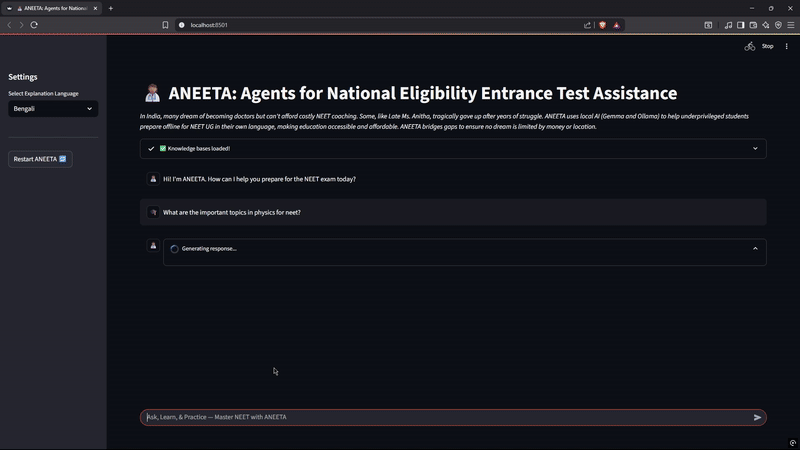
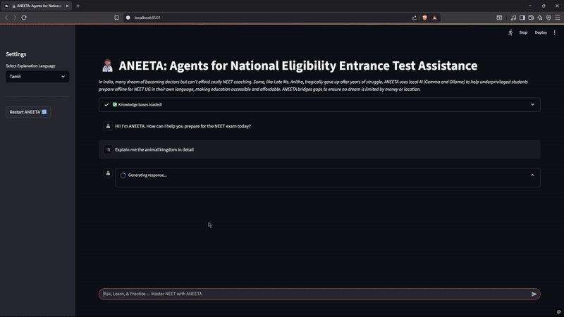
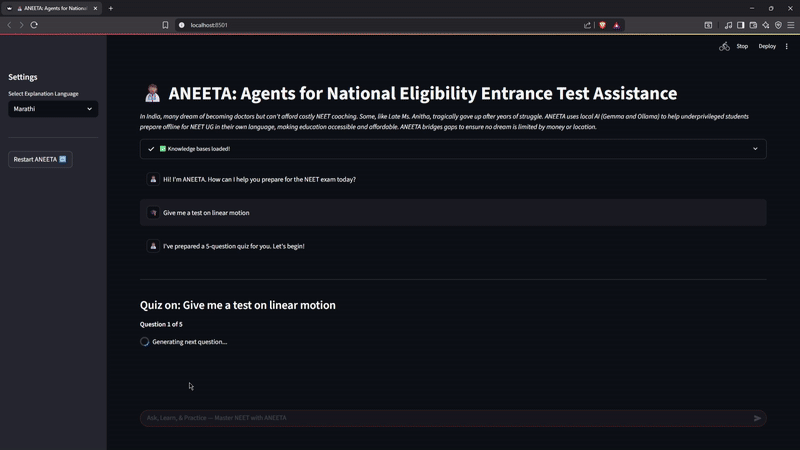
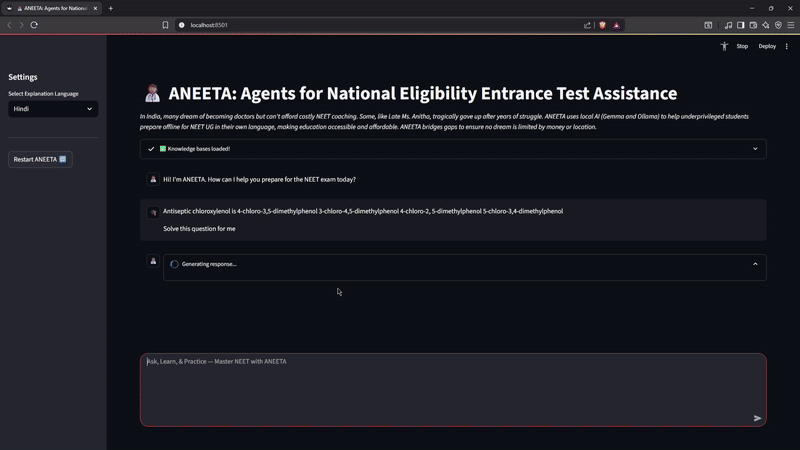

# ANEETA - Agents for National Eligibility cum Entrance Test Assistance

### A Multi-Agent AI Tutor for Democratizing Medical Education in India for the Underserved & Underprivileged

---

##  Vision

ANEETA democratizes NEET coaching, making **high-quality medical education** accessible to every aspiring student in India, especially those in **underprivileged and underserved** communities. Success in NEET often requires expensive coaching that excludes millions of talented students. ANEETA aims to break this barrier with an **offline, AI-powered tutor** designed to run on **low-cost, government-distributed laptops**, no internet connection required.

---

##  Demo

Watch how ANEETA empowers aspiring doctors and levels the educational playing field:

👉 [**Demo Video**](#) *(Insert YouTube or GIF link here)*

Complete Technical Write-up: [**ANEETA Kaggle Write-up**](https://www.kaggle.com/competitions/google-gemma-3n-hackathon/writeups/aneeta-agent-for-national-eligibility-cum-entrance)

---

## Key Features

Powered by **Google’s lightweight Gemma-3n model**, ANEETA delivers personalized learning through a **custom multi-agent architecture**. This system operates in **English and various Indian regional languages**, with all content grounded in NCERT textbooks and past NEET papers for maximum accuracy and relevance. This architecture allows a team of specialized agents to collaborate, providing a **holistic and intelligent learning experience** that goes beyond a single chatbot.

  

---

## The Agentic Team

ANEETA operates with a team of specialized agents, each designed for a specific role:

### Mentor Agent  
Guides students with **personalized study plans**, time management, and motivational coaching, drawing insights from **NEET toppers and experts**.

  

---

### Teacher Agent  
Acts as a **subject-matter expert**, explaining complex concepts in **Physics, Chemistry, and Biology** aligned with the **NCERT** syllabus.

  

---

### Trainer Agent  
Generates **custom NEET-format quizzes**, based on the style and difficulty of the **last three years’ official papers**.

  

---

### Doubt Solver Agent  
Provides **quick, precise, and step-by-step solutions** to tough NEET MCQs using **Gemma-3n’s zero-shot reasoning** power.

  

---

##  Technology Stack

| Component         | Purpose                                                                 |
|------------------|-------------------------------------------------------------------------|
| **Gemma-3n**      | Google’s 2B/4B parameter model for efficient, local, multilingual AI    |
| **nomic-embed-text** | Local embedding model powering offline RAG and content vectorization  |
| **ChromaDB**      | Lightweight, local-first vector DB for similarity search                |
| **Ollama**        | Handles local model deployment (Gemma-3n + embedding models)            |
| **LangGraph**     | Multi-agent orchestration using graph-based framework                  |
| **Streamlit**     | Simple, intuitive UI for learners and educators                         |

---

## Conclusion

ANEETA represents a **major leap toward educational equity**. By providing a **sophisticated, offline, AI-powered tutor** on entry-level hardware, it removes the barriers that keep brilliant students from succeeding due to financial constraints.

With ANEETA, **ambition defines success, not access**.

---

## Disclaimer

This is an **experimental project** developed for the **Google - The Gemma 3n Impact Challenge**.  
The system is currently a **work in progress**. Contributions, suggestions, and feedback are **warmly welcomed**!

---

## Contact

We'd love to hear from you! Reach out with questions, ideas, or just to say hi:

### 👤 Jim Harrington JSN 
- 🧑‍💻 [GitHub](https://github.com/jimdatapro)  
- 💼 [LinkedIn](https://linkedin.com/in/jimdatapro)  
- 📧 jimdatapro@gmail.com

---

### 👤 Jabin Joshua S  
- 🧑‍💻 [GitHub](https://github.com/flarrow27)  
- 💼 [LinkedIn](https://linkedin.com/in/jabinjoshua)  
- 📧 jabinjoshua.s@gmail.com

---

> "Let every dream of becoming a doctor be powered by knowledge, not privilege." 💙
